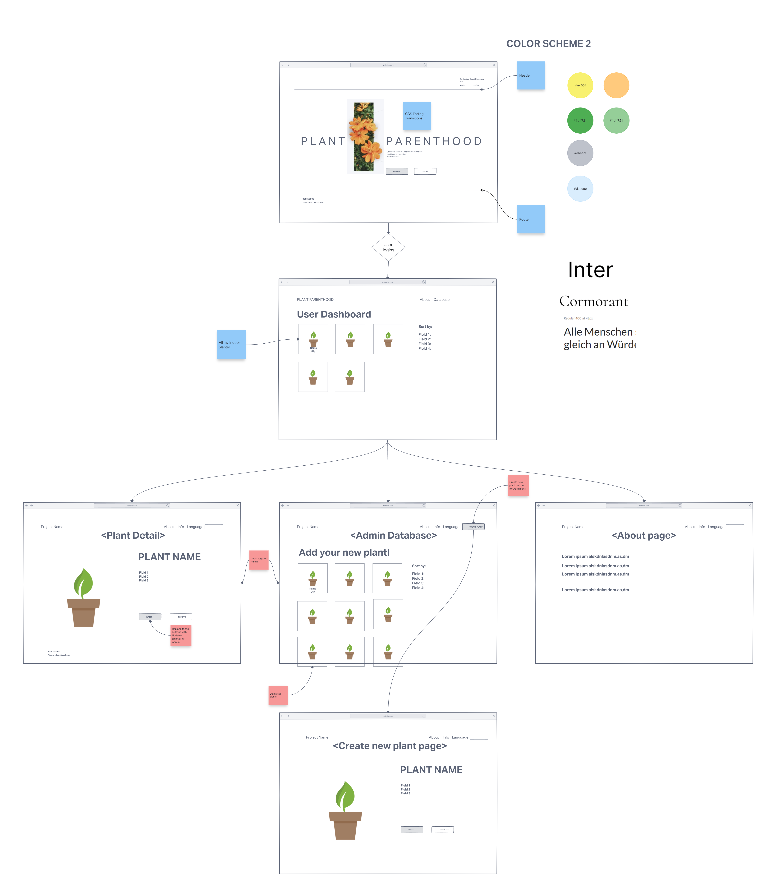
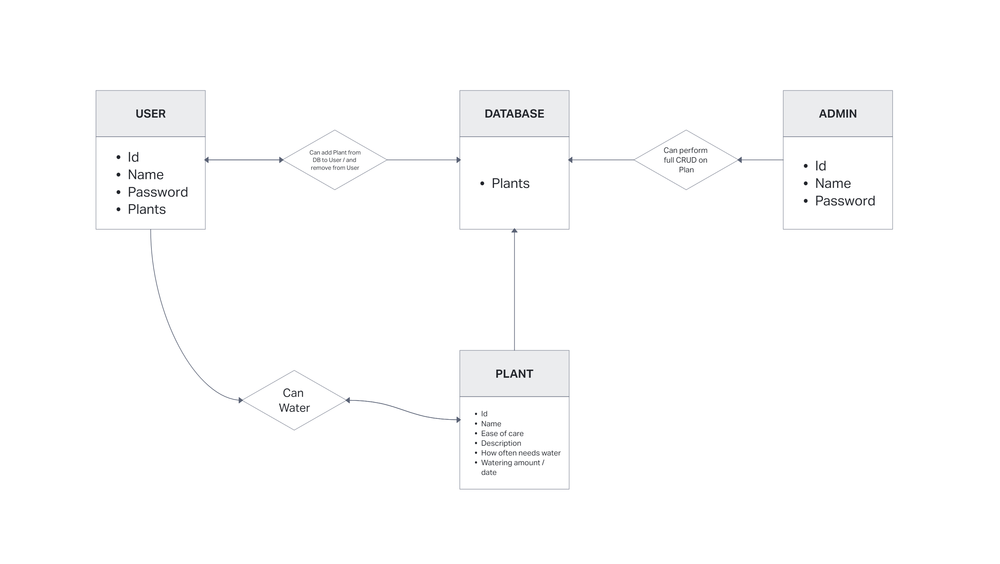

### Plant Parenthood
An app that allows Plant Parent to organize, tend, learn, and share their favorite indoor plants. The Plant Parent will be able to keep track of the watering and feeding of plants they own and get suggestions for which plants suit their level of skill or which plants are easier / difficult to tend to. The Plant Parent will be able to recieve information on various plants along with reccommended plant care tips. Lastly, the Plant Parent will be able to share their plant stories with the community of other Plant Parents. This includes photo upload of their plants, blogs about their experiences, recieve feedback on plant care.

[Click Here] (https://docs.google.com/presentation/d/1w9EXJ40Zl0EQq0UZT1XZ10TUgkHsbPInjGRPclx0slQ/edit?usp=sharing) to see the presentation

## User Stories
- As a user i want to be able to login to my account
- As a user i want to be able to create a new account
- As a user i want to land on the dashboard that displays my collection (Index page)
- As a user I want to be able to add new plants to my collection(Link to create page)
- As a user I want to be able to remove plants from my collection
- As a user I want to be able to track watering of my plants (Time, day, amount?)
- As a user I want to be able to track feeding cycles of my plants 
- As an administrator I want to be able to perform full CRUD on the DB
- As a user i want to see detail information about plants
- As a user I want the plants to be sorted by ease of care (easy, medium, difficult etc)
- As i a user i want the plants to be sorted by indoor or outdoor plants
- As i a user i want the plants to be sorted by plant height
- As a user i want to be  able to filter the plants by ease of care

## Wireframe and ERD

## App Screenshots

## Getting Started
Click to peek at the [Project Planning](https://trello.com/invite/b/hbyxIKmV/b09dd0d53d3da8907fda375afef6b8f5/plant-parenthood) 

Click to peek at the [Project Code](https://github.com/williethewolf/plant_parenthood.git) 

Most importantly you can enjoy the app by clicking this link: [PLANT PARENTHOOD](#)

## Technologies Used
- CSS
- Python
- PostgresSQL
- Docker
- Django
- Trello
- Invision

## Unsolved Problems
Here's a list of issues detected so far:
- Pending

## Future Enhancements
- As a user I want to be able to suggest new plants to the available plant DB
- As an administrator I want to be able to approve suggested plants from the Queue
- As i a user i want to have a community to feature plants
- As a user i want to be able to add photos of my plants
- As a user i want the app to be mobile responsive
